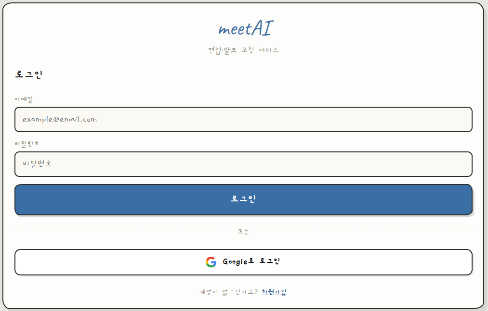
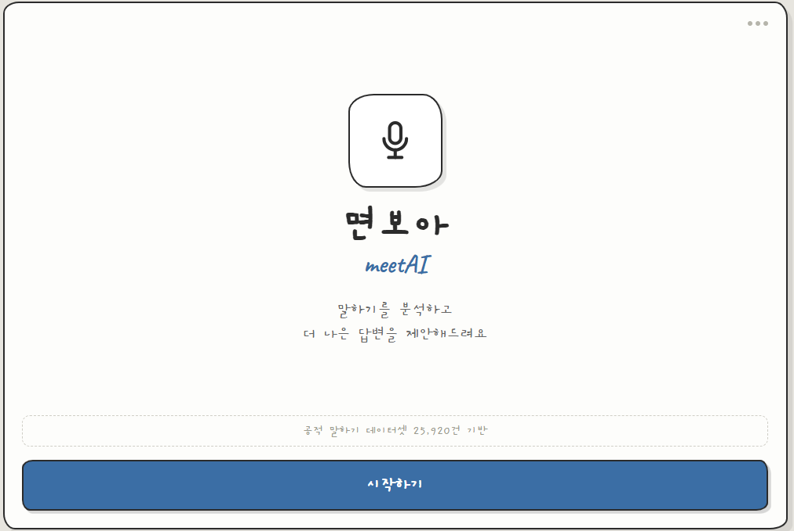
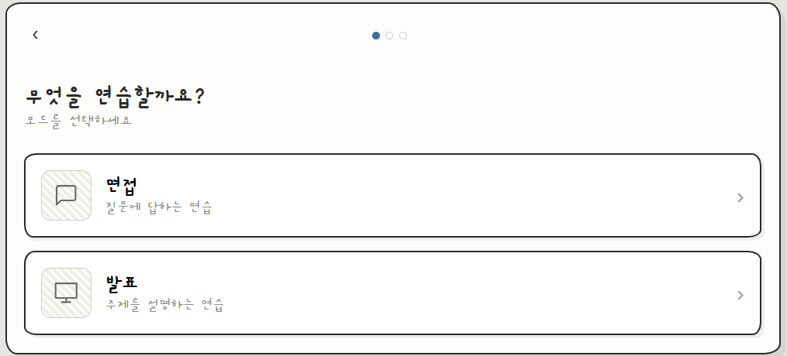
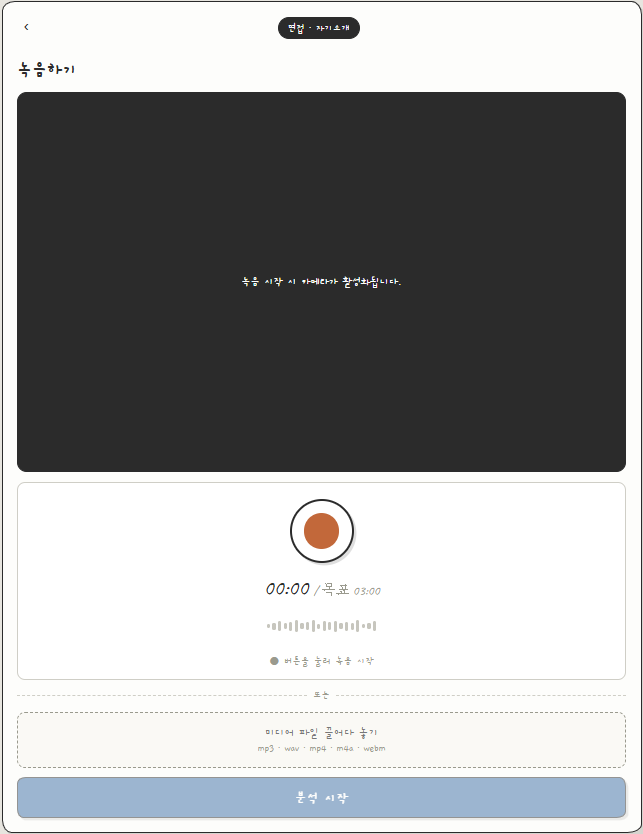
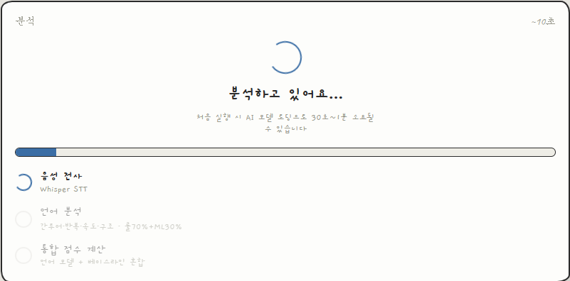
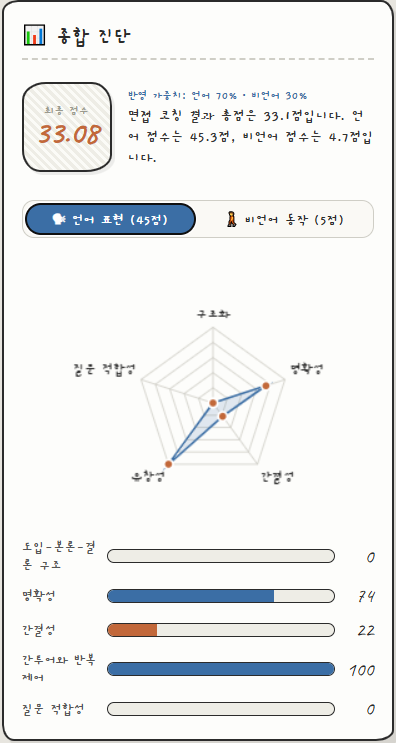
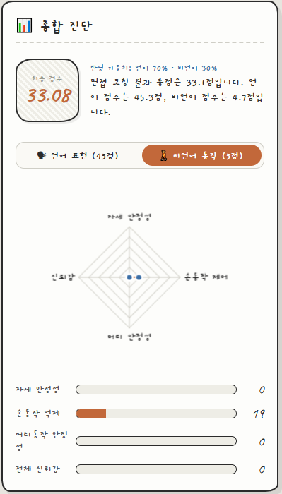
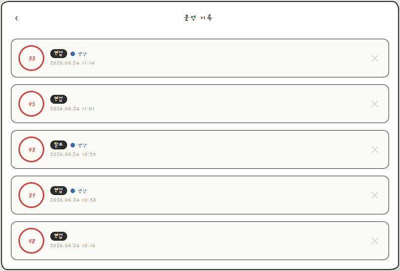

# meetAI — 면접·발표 AI 코칭 서비스

> 한국어 공적 말하기 데이터셋 기반으로 언어·비언어 표현을 분석하고 맞춤형 피드백을 제공하는 AI 코칭 서비스

---

## 시연 화면

| 로그인 | 홈 | 모드 선택 |
|:---:|:---:|:---:|
|  |  |  |

| 녹음 | 분석 중 | 결과 — 언어 |
|:---:|:---:|:---:|
|  |  |  |

| 결과 — 비언어 | 분석 기록 |
|:---:|:---:|
|  |  |

> 📸 스크린샷은 `docs/screenshots/` 폴더에 추가해주세요.

---

## 주요 기능

### 언어 분석
| 지표 | 설명 |
|------|------|
| 명확성 (Clarity) | 문장 구조의 명확성 |
| 유창성 (Fluency) | 간투어·반복 억제 |
| 구조 (Structure) | 도입-본론-결론 구성 |
| 질문 적합성 (Question Fit) | 핵심 키워드 반영도 |
| 간결성 (Brevity) | 발화 길이·밀도 적절성 |

### 비언어 분석
| 지표 | 설명 |
|------|------|
| 자세 안정성 | 자세 흔들림 이벤트 감지 |
| 손동작 제어 | 과도한 손동작 억제 |
| 머리 안정성 | 머리 움직임 이벤트 감지 |
| 신뢰감 | 종합 비언어 신뢰도 |

### 기타
- 🎙 음성 직접 녹음 또는 파일 업로드 (mp3 / mp4 / wav / m4a / webm)
- 📹 영상 녹화 + 다운로드 (16:10 비율)
- 🤖 AI 개선 답변 제안
- 📊 5축 레이더 차트 시각화
- 🔐 이메일 / Google 소셜 로그인
- 📂 분석 기록 저장 및 영상 다시보기

---

## 기술 스택

### Backend
| 항목 | 내용 |
|------|------|
| Language | Python 3.13 |
| Framework | FastAPI |
| STT | OpenAI Whisper (medium, CUDA) |
| GPU | NVIDIA CUDA 12.4 |
| Auth / DB / Storage | Supabase |

### Frontend
| 항목 | 내용 |
|------|------|
| Framework | React 18 + Vite 5 |
| 차트 | Chart.js + react-chartjs-2 |
| 폰트 | Gaegu · Caveat (Google Fonts) |
| 인증 | @supabase/supabase-js |

---

## 프로젝트 구조

```
meetAI/
├── app/
│   ├── api/                      # FastAPI 라우터
│   │   ├── routes_upload.py      # 오디오 업로드 + STT
│   │   ├── routes_analysis.py    # 언어·비언어·통합 분석
│   │   ├── routes_auth.py        # 인증
│   │   └── routes_history.py     # 분석 기록 CRUD
│   ├── analyzers/                # 분석 엔진
│   │   ├── language/             # 언어 분석 (룰 기반 + ML)
│   │   └── nonverbal/            # 비언어 분류기
│   ├── core/                     # 공통 설정
│   │   ├── config.py
│   │   ├── supabase_client.py
│   │   └── auth.py
│   ├── services/                 # 비즈니스 로직
│   │   ├── stt_service.py        # Whisper STT
│   │   ├── language_service.py
│   │   └── nonverbal_service.py
│   ├── schemas/                  # Pydantic 스키마
│   └── ui/                       # React 프론트엔드
│       └── src/
│           ├── pages/
│           ├── components/
│           ├── api.js
│           └── supabase.js
├── scripts/
│   └── supabase_schema.sql       # DB 스키마
├── outputs/checkpoints/          # 학습된 모델
└── requirements.txt
```

---

## 시작하기

### 요구 사항

- Python 3.11+
- Node.js 18+
- ffmpeg (PATH 등록)
- NVIDIA GPU + CUDA 12.x (CPU도 동작하나 느림)
- [Supabase](https://supabase.com) 프로젝트

### 1. 저장소 클론

```bash
git clone https://github.com/<your-username>/meetAI.git
cd meetAI
```

### 2. Python 환경 설정

```bash
python -m venv .venv
.venv\Scripts\activate
pip install -r requirements.txt

# CUDA 지원 PyTorch
pip install torch --index-url https://download.pytorch.org/whl/cu124
```

### 3. 프론트엔드 의존성 설치

```bash
cd app/ui
npm install
cd ../..
```

### 4. Supabase 설정

1. [supabase.com](https://supabase.com)에서 새 프로젝트 생성
2. SQL Editor에서 `scripts/supabase_schema.sql` 실행
3. Authentication → Providers → Google 활성화 (선택)

### 5. 환경변수 설정

**`.env`** (백엔드)
```env
SUPABASE_URL=https://xxxx.supabase.co
SUPABASE_ANON_KEY=sb_publishable_...
SUPABASE_SERVICE_ROLE_KEY=sb_secret_...
```

**`app/ui/.env`** (프론트엔드)
```env
VITE_SUPABASE_URL=https://xxxx.supabase.co
VITE_SUPABASE_ANON_KEY=sb_publishable_...
```

### 6. 서버 실행

```bash
# 백엔드
.venv\Scripts\uvicorn app.main:app --host 0.0.0.0 --port 8000 --reload

# 프론트엔드 (별도 터미널)
cd app/ui && npm run dev
```

접속: [http://localhost:5173/ui/](http://localhost:5173/ui/)

---

## API 문서

서버 실행 후 [http://localhost:8000/docs](http://localhost:8000/docs) 에서 Swagger UI 확인

| 메서드 | 경로 | 설명 |
|--------|------|------|
| `POST` | `/upload/audio` | 오디오/영상 업로드 → STT → 언어 분석 |
| `POST` | `/analyze/language` | 전사문 언어 분석 |
| `POST` | `/analyze/nonverbal` | 비언어 이벤트 분석 |
| `POST` | `/analyze/full` | 언어 + 비언어 통합 분석 |
| `POST` | `/auth/register` | 회원가입 |
| `POST` | `/auth/login` | 로그인 |
| `GET` | `/history` | 분석 기록 목록 |
| `DELETE` | `/history/{id}` | 분석 기록 삭제 |

---

## 환경변수

| 변수 | 설명 |
|------|------|
| `SUPABASE_URL` | Supabase 프로젝트 URL |
| `SUPABASE_ANON_KEY` | Supabase anon 키 (`sb_publishable_...`) |
| `SUPABASE_SERVICE_ROLE_KEY` | Supabase service role 키 — **서버 전용, 절대 노출 금지** |
| `WHISPER_MODEL` | Whisper 모델 크기 (기본: `medium`) |

---

## License

MIT
